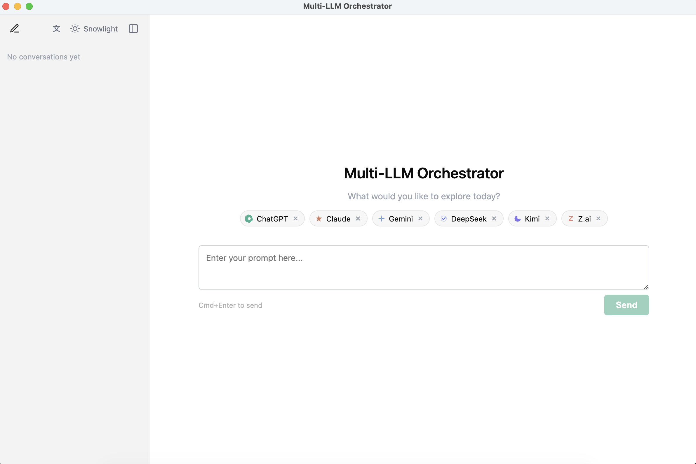
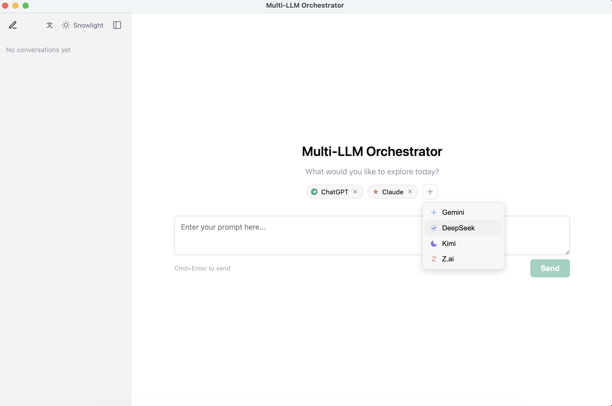
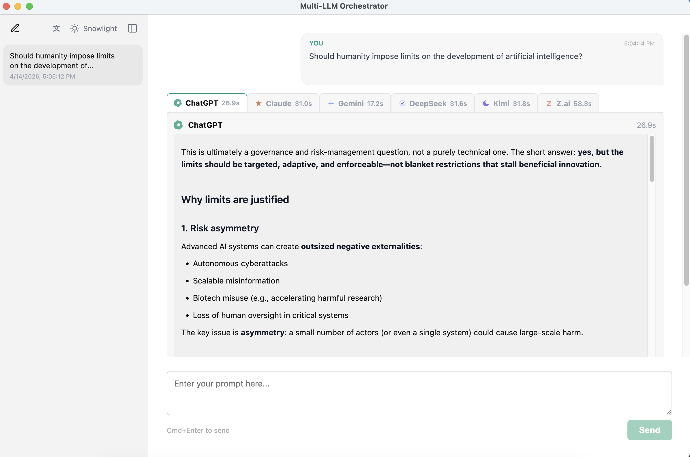
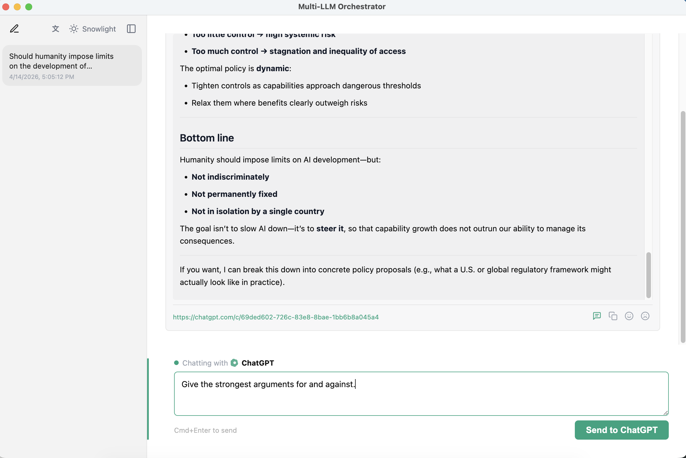

# Chorus

**Ask once. Compare every answer.**

Chorus is a desktop app for people who already use the official AI chat websites and want a smoother way to compare them.

With Chorus, you can send one question to **ChatGPT, Claude, Gemini, Kimi, DeepSeek, and Z.ai at the same time**, then read the answers side by side in one clean window.

[中文说明](README.zh.md)

---

## Why Chorus exists

If you subscribe to more than one AI service, everyday use gets repetitive fast:

- Copy the same prompt into several browser tabs
- Wait for each answer separately
- Jump back and forth to compare them
- Lose time repeating simple follow-up work

Chorus removes that friction without asking you to abandon the tools you already use.

Chorus helps you get more value from the AI services you already pay for.

---

## What makes Chorus different

Most multi-model tools try to replace the official AI websites. Chorus does the opposite.

- **Minimal-invasive**: Chorus works with the official chat websites instead of replacing them.
- **Plug-and-play**: sign in to the websites you already use, then start comparing answers.
- **100% data ownership**: your chats still live on the official services you use.
- **Familiar experience**: each message goes to the same default model and workflow you already know on that website.
- **Easy exit**: if you stop using Chorus, your conversations are still available on the official sites.

Chorus is an **enhancement layer**, not a lock-in platform.

---

## At a glance

<table>
  <tr>
    <td width="50%">
      
      <p><strong>Clean desktop layout</strong><br/>See your providers, conversation history, and active workspace in one place.</p>
    </td>
    <td width="50%">
      
      <p><strong>Add the services you already use</strong><br/>Turn providers on and off without changing your existing accounts or habits.</p>
    </td>
  </tr>
  <tr>
    <td width="50%">
      
      <p><strong>Compare answers side by side</strong><br/>Ask one research question and immediately see where the models agree, differ, or miss key points.</p>
    </td>
    <td width="50%">
      
      <p><strong>Continue with one model when needed</strong><br/>Open a focused follow-up chat while keeping the link to the official conversation and its context.</p>
    </td>
  </tr>
</table>

---

## What you can do

- Ask one question and get multiple answers at once
- Compare tone, depth, structure, and reasoning across providers
- Continue the conversation with one provider after the first comparison
- Keep a local record of prompts and responses for convenience
- Rename or hide chats in the sidebar without disrupting the official chat history

This is especially useful for research-style questions, decision-making, writing, planning, and fact-checking across multiple AI services.

---

## How Chorus works

Chorus opens and operates the **official AI chat websites** for you in the background.

- You log in with your normal accounts
- Chorus reuses those signed-in sessions
- Your passwords are **not stored** by Chorus
- Your chats still belong to the official services you use

Chorus also keeps a local copy of prompts and responses so the desktop app stays convenient to use. That local data is yours. You can manage it however you want, and you are not trapped inside Chorus.

---

## Before you start

You will need:

- A Mac
- [Node.js 18 or newer](https://nodejs.org/)
- At least one AI chat account you can sign in to, such as ChatGPT, Claude, Gemini, Kimi, DeepSeek, or Z.ai

Chorus is currently developed and tested on **macOS**. Windows and Linux are not officially supported yet.

---

## Installation

If you are not used to the Terminal, that is fine. The commands below can be copied exactly as written.

### 1. Download the project

```bash
git clone https://github.com/TokenBlade/chorus.git
cd chorus
```

### 2. Install the app's dependencies

```bash
npm install
```

This step downloads the pieces Chorus needs in order to run on your computer.

### 3. Launch Chorus

```bash
npm start
```

On first launch, Chorus may take a little longer because it builds the app before opening it.

---

## First-time setup

When Chorus opens for the first time:

1. Enable the AI services you want to use.
2. Sign in to the official websites when Chorus opens them.
3. Return to the app and send your first prompt.

After that, Chorus reuses your local signed-in sessions so you usually do not need to log in every time.

---

## Everyday use

1. Choose the AI services you want to ask.
2. Type your prompt.
3. Press **Cmd+Enter** to send it.
4. Compare the answers side by side.
5. Click one result if you want to continue the conversation with that provider only.

Example prompt for testing:

`Should humanity impose limits on the development of artificial intelligence? Give the strongest arguments for and against.`

---

## Supported AI services

| Service | Official website |
| --- | --- |
| ChatGPT | chat.openai.com |
| Claude | claude.ai |
| Gemini | gemini.google.com |
| Kimi | kimi.com |
| DeepSeek | chat.deepseek.com |
| Z.ai | chat.z.ai |

---

## Frequently asked questions

### Do I need API keys?

No. Chorus is designed for people who use the official chat websites.

### Do I need new subscriptions?

No extra Chorus subscription is required. You only need access to the AI services you already use.

### Does Chorus replace the official websites?

No. Chorus is intentionally restrained. It improves the experience of using multiple official AI websites together.

### Does Chorus store my passwords?

No. Chorus uses your signed-in browser sessions but does not store your credentials.

### What happens if I stop using Chorus?

Your chats remain on the official AI websites you used. Chorus does not create lock-in.

---

## For developers

If you are working on the codebase itself:

### Run in development mode

```bash
npm run dev
```

### Build from source

```bash
npm run build
```

The built app is written to `out/`.

### Run tests

```bash
npm test
```

---

## License

Apache License 2.0. See [LICENSE](LICENSE).
