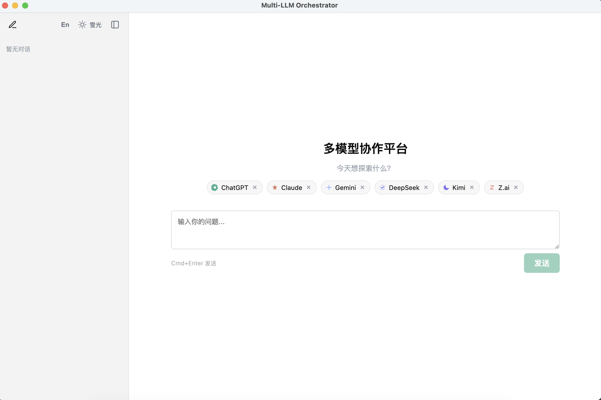
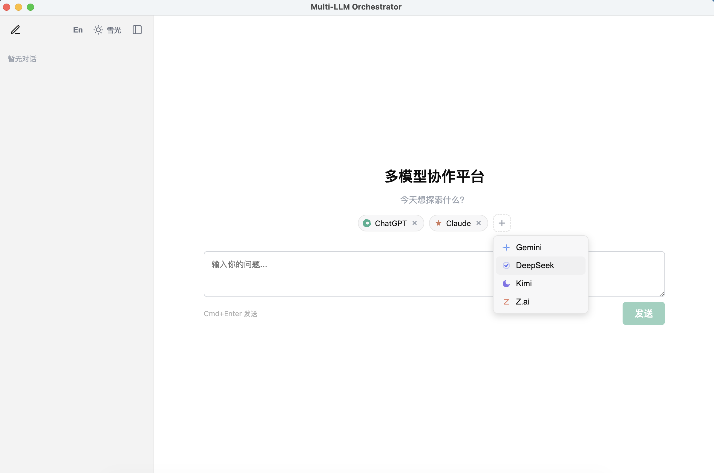
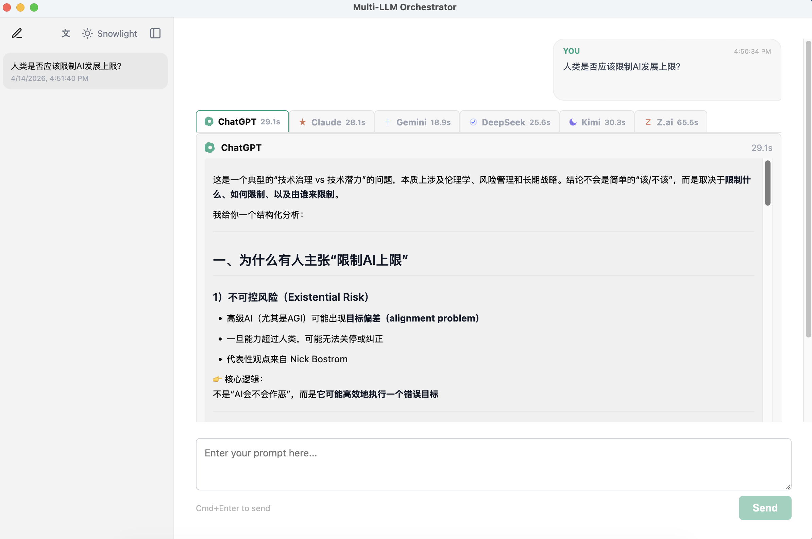
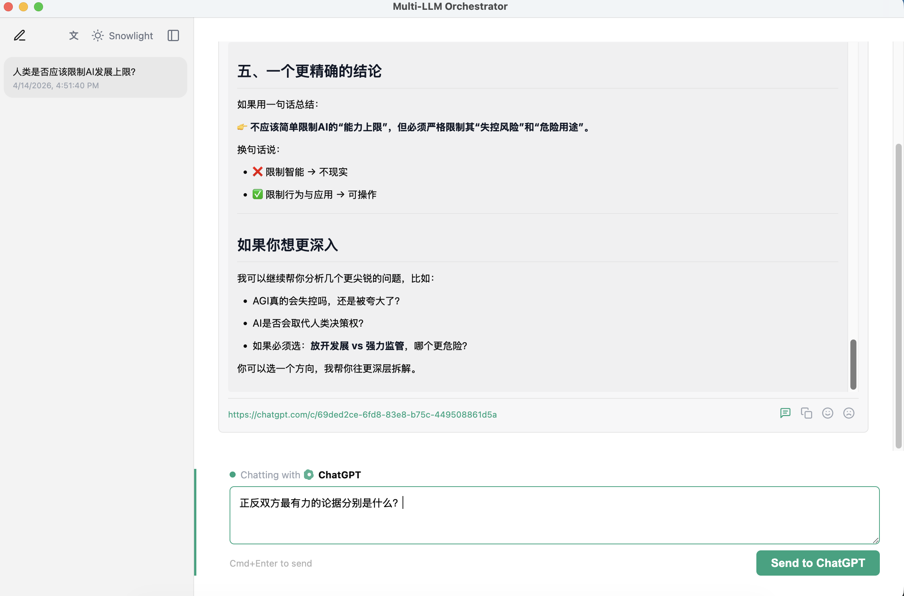

# Chorus（众声）

**一次提问，并排比较所有答案。**

Chorus 是一款面向日常 AI 用户的桌面应用，适合那些已经在使用各家官方 AI 聊天网站、但希望更高效比较它们的人。

借助 Chorus，你可以把同一个问题同时发给 **ChatGPT、Claude、Gemini、Kimi、DeepSeek 和 Z.ai**，然后在一个清爽的窗口里并排查看回答。

[English](README.md)

---

## Chorus 为什么存在

如果你同时订阅了多个 AI 服务，日常使用通常会变得很繁琐：

- 把同一个问题反复复制到多个网页标签
- 分别等待每个服务生成答案
- 来回切换页面做比较
- 做追问时还要重复很多机械操作

Chorus 的目的，就是在不改变你原本使用习惯的前提下，把这些麻烦拿掉。

Chorus 帮助你从已经付费使用的 AI 服务中获得更多价值。

---

## Chorus 真正特别的地方

很多多模型工具都在试图“取代”官方 AI 网站，而 Chorus 选择了相反的方向。

- **最小侵入**：Chorus 不替代官方网站，而是和官方聊天网站协同工作。
- **即插即用**：登录你本来就在用的账号，就可以开始同时比较多个模型。
- **100% 数据归属用户**：你的聊天记录依然保留在各家官方服务里。
- **体验熟悉**：每次发送，使用的仍是你在官网默认使用的模型与工作流。
- **随时可退出**：即使以后不再使用 Chorus，你的对话依然在官方网站上，不会被绑定。

Chorus 的定位不是一个新平台，而是一层**增强官方体验的桌面外壳**。

---

## 一眼看懂 Chorus

<table>
  <tr>
    <td width="50%">
      
      <p><strong>清爽的桌面布局</strong><br/>在一个界面里同时看到模型选择、历史记录和当前工作区。</p>
    </td>
    <td width="50%">
      
      <p><strong>添加你本来就在用的服务</strong><br/>按需启用或关闭不同 AI 服务，不改变已有账号和使用习惯。</p>
    </td>
  </tr>
  <tr>
    <td width="50%">
      
      <p><strong>并排比较多个答案</strong><br/>输入一个研究型问题，快速看出不同模型在哪些地方一致、分歧或遗漏重点。</p>
    </td>
    <td width="50%">
      
      <p><strong>需要时再单独深聊</strong><br/>先横向比较，再进入某个模型继续追问，同时保留与官网会话的对应关系。</p>
    </td>
  </tr>
</table>

---

## 你可以用 Chorus 做什么

- 一次提问，同时获得多个 AI 的回答
- 并排比较不同模型的语气、深度、结构和推理方式
- 在首次比较之后，继续与某一个模型单独对话
- 为了方便使用，在本地保留提示词和回答记录
- 在侧边栏重命名或隐藏聊天记录，而不影响官网上的历史会话

这尤其适合研究型问题、方案比较、写作辅助、信息整理，以及需要多模型交叉参考的场景。

---

## Chorus 是怎么工作的

Chorus 会在后台打开并操作**官方 AI 聊天网站**。

- 你使用的是自己原本的账号
- Chorus 复用你本地已登录的会话
- Chorus **不会保存你的密码**
- 你的聊天依然属于你使用的官方服务

为了方便桌面端使用，Chorus 也会在本地保存提示词和回答副本。这些本地数据归你所有，你可以自行处理。即使删除 Chorus，也不会影响你在各家官网中的聊天记录。

---

## 开始之前

你需要准备：

- 一台 Mac
- [Node.js 18 或更高版本](https://nodejs.org/)
- 至少一个可登录的 AI 聊天账号，例如 ChatGPT、Claude、Gemini、Kimi、DeepSeek 或 Z.ai

目前 Chorus 主要在 **macOS** 上开发与测试。Windows 和 Linux 暂未正式支持。

---

## 安装方法

如果你平时不常用终端，也没关系。下面的命令可以直接复制粘贴。

### 1. 下载项目

```bash
git clone https://github.com/TokenBlade/chorus.git
cd chorus
```

### 2. 安装运行所需依赖

```bash
npm install
```

这一步会把 Chorus 在你电脑上运行所需要的组件下载下来。

### 3. 启动 Chorus

```bash
npm start
```

第一次启动可能会稍慢一些，因为应用会先完成构建再打开。

---

## 首次使用

第一次打开 Chorus 时：

1. 选择你想启用的 AI 服务。
2. 按提示登录对应的官方网站。
3. 回到 Chorus，发送你的第一个问题。

之后 Chorus 会复用本地登录状态，通常不需要每次都重新登录。

---

## 日常使用方式

1. 选择你想一起提问的 AI 服务。
2. 输入问题。
3. 按 **Cmd+Enter** 发送。
4. 并排比较它们的回答。
5. 如果想深入某一个模型，点击对应结果继续追问。

可用于演示的示例问题：

`Should humanity impose limits on the development of artificial intelligence? Give the strongest arguments for and against.`

---

## 支持的 AI 服务

| 服务 | 官方网站 |
| --- | --- |
| ChatGPT | chat.openai.com |
| Claude | claude.ai |
| Gemini | gemini.google.com |
| Kimi | kimi.com |
| DeepSeek | chat.deepseek.com |
| Z.ai | chat.z.ai |

---

## 常见问题

### 需要 API Key 吗？

不需要。Chorus 面向的是直接使用官方聊天网站的用户。

### 需要额外订阅 Chorus 吗？

不需要。除了你本来就在使用的 AI 服务外，Chorus 不要求额外订阅。

### Chorus 会取代官方网站吗？

不会。Chorus 的设计目标非常克制，只是把多个官方 AI 网站的联合使用体验做得更顺手。

### Chorus 会保存我的密码吗？

不会。Chorus 使用的是你已登录的本地浏览器会话，不会保存账号密码。

### 如果以后不用 Chorus 了怎么办？

你的对话仍然保留在你使用的官方 AI 网站中，不会因为离开 Chorus 而丢失。

---

## 给开发者

如果你是为了参与开发：

### 开发模式运行

```bash
npm run dev
```

### 从源码构建

```bash
npm run build
```

构建结果会输出到 `out/` 目录。

### 运行测试

```bash
npm test
```

---

## 开源协议

Apache License 2.0，详见 [LICENSE](LICENSE)。
